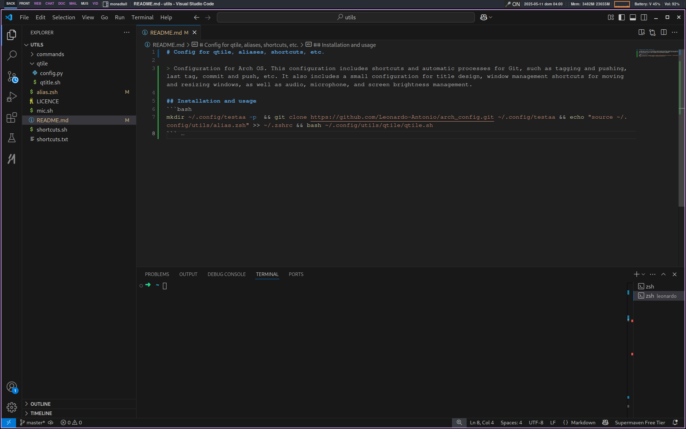

# Config for qtile, aliases, shortcuts, etc.

> Configuration for Arch OS. This configuration includes shortcuts and automatic processes for Git, such as tagging and pushing, last tag, commit and push, etc. It also includes a small configuration for title design, window management shortcuts for moving and resizing windows, as well as audio, microphone, and screen brightness management.

## Installation and usage
```bash
mkdir ~/.config/utils -p  && git clone https://github.com/Leonardo-Antonio/arch_config.git ~/.config/utils && echo "source ~/.config/utils/alias.zsh" >> ~/.zshrc && bash ~/.config/utils/qtile/qtile.sh
```

## Permissions
```bash
sudo chmod +x ~/.config/utils/toggle_audio_spotify.sh ~/.config/utils/share_screen_mobile.sh ~/.config/utils/control_audio_spotify.sh
```

### Example of the configuration:
