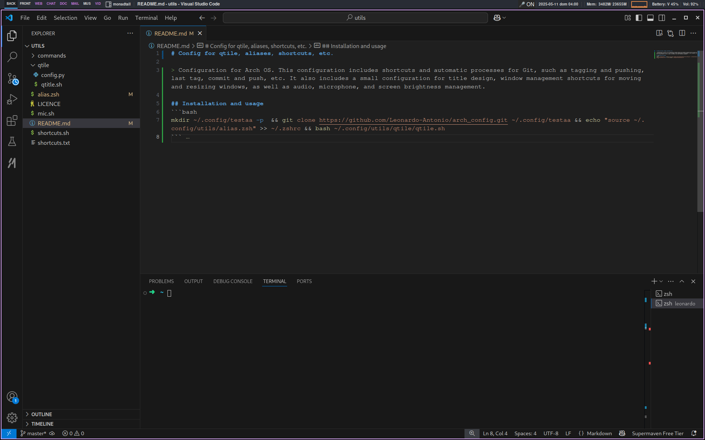

# Configuracion personal para Arch Linux, Qtile, alias y utilidades

Este repositorio contiene una configuracion de Qtile, alias para Zsh, atajos y scripts auxiliares para Git, audio, Spotify, brillo, bateria, rofi, apagado de sesion y compartir pantalla de Android con `scrcpy`.

La guia asume un entorno limpio en Arch Linux. Si ya tienes parte de estas herramientas instaladas, `pacman` simplemente las omitira o las actualizara.

## Contenido del repositorio

- `qtile/config.py`: configuracion principal de Qtile.
- `qtile/qtitle.sh`: instalacion base de paquetes para Qtile y enlace simbolico de `config.py`.
- `alias.zsh`: alias de Git, proyectos locales y utilidades.
- `commands/git/*.sh`: automatizaciones para commits, tags y clonacion de repositorios.
- `control_audio_spotify.sh`: control de Spotify con `playerctl`.
- `toggle_audio_spotify.sh`: mute/unmute del audio de Spotify con `pactl`.
- `mic.sh`: toggle del microfono con `amixer`.
- `battery.sh`: alerta de bateria baja con `notify-send`.
- `share_screen_mobile.sh`: configuracion ADB/udev y ejecucion de `scrcpy`.
- `powermenu_qtile.sh`: menu de bloqueo, logout, reboot y shutdown con rofi.
- `shortcuts.sh` y `shortcuts.txt`: configuracion basica de `sxhkd`.

## Requisitos

- Arch Linux o una distribucion compatible con `pacman`.
- Usuario con permisos de `sudo`.
- Sesion grafica X11. Esta configuracion usa herramientas X11 como `xbindkeys`, `dmenu`, `xorg-xev`, `xorg-xwininfo` y `flameshot gui`.
- Zsh si quieres cargar `alias.zsh` desde `~/.zshrc`.
- GDM es el gestor de sesion esperado por `powermenu_qtile.sh` para volver al login o cambiar de usuario.

## Instalacion desde cero

### 1. Instalar dependencias del sistema

```bash
sudo pacman -Syu

sudo pacman -S --needed \
  git sudo bash zsh coreutils gawk grep sed procps-ng inetutils \
  qtile python-pip python-setuptools python-psutil \
  xorg-server xorg-xinit xorg-xev xorg-xwininfo \
  rofi dmenu sxhkd xbindkeys picom \
  terminator qutebrowser flameshot brightnessctl feh htop \
  alsa-utils pipewire pipewire-pulse pavucontrol libnotify playerctl \
  network-manager-applet \
  android-tools scrcpy usbutils \
  ttf-cascadia-code-nerd noto-fonts-emoji
```

Notas:

- `alsa-utils` provee `amixer`, usado por el widget del microfono y `mic.sh`.
- `pipewire-pulse` provee compatibilidad con `pactl`, usado para volumen y mute de Spotify. Si usas PulseAudio clasico, puedes instalar `pulseaudio` en lugar de `pipewire-pulse`.
- `python-psutil` evita problemas con widgets de Qtile como memoria y graficos.
- `ttf-cascadia-code-nerd` es necesario porque `qtile/config.py` usa `CaskaydiaCove Nerd Font`.
- `noto-fonts-emoji` ayuda a mostrar iconos emoji usados por algunos scripts.

### 2. Instalar dependencias opcionales

Estas herramientas no son obligatorias para arrancar Qtile, pero mejoran funciones concretas del repositorio.

```bash
sudo pacman -S --needed i3lock
```

- `i3lock`: fallback de bloqueo para `powermenu_qtile.sh`.
- `betterlockscreen`: si lo prefieres sobre `i3lock`, instalalo desde AUR con tu helper habitual.
- `gdm`: recomendado si quieres que `powermenu_qtile.sh` pueda volver al greeter de GDM.
- `spotify`: necesario para que `control_audio_spotify.sh` y `toggle_audio_spotify.sh` tengan una aplicacion que controlar.
- `discord`: los alias y atajos esperan Discord en `/opt/discord/Discord` o `/opt/discord/discord`.

### 3. Clonar el repositorio

```bash
mkdir -p ~/.config
git clone https://github.com/Leonardo-Antonio/arch_config.git ~/.config/utils
```

Si ya existe `~/.config/utils`, entra al directorio y actualizalo:

```bash
cd ~/.config/utils
git pull
```

### 4. Dar permisos de ejecucion

```bash
chmod +x \
  ~/.config/utils/*.sh \
  ~/.config/utils/qtile/*.sh \
  ~/.config/utils/commands/git/*.sh
```

### 5. Cargar los alias de Zsh

```bash
grep -qxF 'source ~/.config/utils/alias.zsh' ~/.zshrc || echo 'source ~/.config/utils/alias.zsh' >> ~/.zshrc
source ~/.zshrc
```

Ten en cuenta que algunos alias son especificos del entorno del autor:

- `gdpversion` espera `/home/leonardo/Projects/gdpversions/gdpversion`.
- `gdpvpn` espera `~/.config/vpn/run.sh`.
- `4gms`, `4gmf`, `checkupdate` y `pb` esperan rutas locales concretas.

Los alias genericos de Git (`pull`, `push`, `commit`, `ptag`, `ctag`, `ltag`, `pcommit`) funcionan en cualquier repositorio Git.

### 6. Instalar la configuracion de Qtile

El script correcto del repositorio es `qtile/qtitle.sh`.

```bash
bash ~/.config/utils/qtile/qtitle.sh
```

Ese script instala parte de los paquetes base, crea `~/.config/qtile` y enlaza:

```bash
~/.config/qtile/config.py -> ~/.config/utils/qtile/config.py
```

Si prefieres hacerlo manualmente:

```bash
mkdir -p ~/.config/qtile
ln -sf ~/.config/utils/qtile/config.py ~/.config/qtile/config.py
```

Despues inicia o reinicia Qtile desde tu gestor de sesion. Si ya estas dentro de Qtile:

```bash
qtile cmd-obj -o cmd -f restart
```

### 7. Instalar los temas y lanzadores de rofi

Esta configuracion llama rutas externas que no estan incluidas en este repositorio:

- `~/.config/rofi/launchers/type-3/launcher.sh`
- `~/.config/rofi/rofi__file.sh`
- `~/.config/rofi/powermenu/type-1/style-1.rasi`

Instala o copia tus temas de rofi en esas rutas. Una opcion comun es usar los temas de `adi1090x/rofi`:

```bash
git clone --depth=1 https://github.com/adi1090x/rofi.git /tmp/adi1090x-rofi
mkdir -p ~/.config/rofi
cp -r /tmp/adi1090x-rofi/files/* ~/.config/rofi/
```

Luego verifica que existan:

```bash
test -x ~/.config/rofi/launchers/type-3/launcher.sh
test -f ~/.config/rofi/powermenu/type-1/style-1.rasi
```

Si `~/.config/rofi/rofi__file.sh` no existe, crea tu propio lanzador de archivos o cambia la ruta en `qtile/config.py`.

### 8. Configurar atajos con sxhkd

```bash
bash ~/.config/utils/shortcuts.sh
```

El script crea `~/.config/sxhkd/sxhkdrc` desde `shortcuts.txt` y agrega `sxhkd &` a `~/.zshrc`.

## Uso principal

### Atajos de Qtile

- `Super + Enter`: abrir `terminator`.
- `Super + Shift + Enter`: abrir `dmenu_run`.
- `Super + B`: abrir `qutebrowser`.
- `Super + F11`: captura con `flameshot`.
- `Super + F1`: mute/unmute del audio principal.
- `Super + F2` / `Super + F3`: bajar/subir volumen.
- `Super + F4` / `Super + F5`: bajar/subir brillo.
- `Super + S`: abrir launcher de rofi.
- `Super + O`: abrir lanzador de archivos configurado en rofi.
- `Super + Q`: cerrar ventana.
- `Super + Shift + R`: reiniciar Qtile.
- `Super + Shift + Q`: salir de Qtile.

### Scripts utiles

```bash
# Control de Spotify
~/.config/utils/control_audio_spotify.sh toggle
~/.config/utils/control_audio_spotify.sh next
~/.config/utils/control_audio_spotify.sh prev

# Mute/unmute solo del audio de Spotify
~/.config/utils/toggle_audio_spotify.sh

# Toggle del microfono
~/.config/utils/mic.sh

# Compartir pantalla de Android por USB
~/.config/utils/share_screen_mobile.sh

# Menu de energia para Qtile
~/.config/utils/powermenu_qtile.sh
```

Para `share_screen_mobile.sh`, activa la depuracion USB en Android antes de ejecutar el script. El script instala una regla udev para vendor id `0e8d`; si tu telefono usa otro fabricante, cambia `ATTR{idVendor}` por el id correcto obtenido con `lsusb`.

### Alias de Git

```bash
ltag                 # muestra el ultimo tag no-dev
ltag dev             # muestra el ultimo tag incluyendo dev
ptag v1.2.3          # crea y sube un tag liviano
ctag v1.2.3 "msg"    # commit, tag anotado y push
pcommit "mensaje"    # git add ., commit y push a la rama actual
```

## Verificacion

Ejecuta estos comandos despues de instalar:

```bash
command -v qtile
command -v rofi
command -v pactl
command -v amixer
command -v playerctl
command -v brightnessctl
fc-match "CaskaydiaCove Nerd Font"
python -m py_compile ~/.config/utils/qtile/config.py
```

Si todo esta bien, `python -m py_compile` no imprimira errores.

## Problemas comunes

- La barra muestra cuadros vacios: falta `ttf-cascadia-code-nerd` o Qtile no esta usando la fuente esperada.
- `pactl: command not found`: instala `pipewire-pulse` o `pulseaudio`.
- El microfono no cambia: revisa el nombre del control ALSA con `amixer scontrols`; el script espera `Capture`.
- Rofi no abre: faltan los scripts o temas externos en `~/.config/rofi`.
- El control de Spotify no responde: Spotify debe estar abierto y `playerctl -l` debe listar `spotify`.
- El brillo no cambia: tu usuario puede necesitar permisos sobre backlight o una regla de udev compatible con `brightnessctl`.
- `share_screen_mobile.sh` no detecta el telefono: activa depuracion USB, acepta la huella RSA en Android y revisa el vendor id con `lsusb`.
- `powermenu_qtile.sh` no bloquea: instala `i3lock` o `betterlockscreen`; si no existen, usa `loginctl lock-session`.

## Captura


